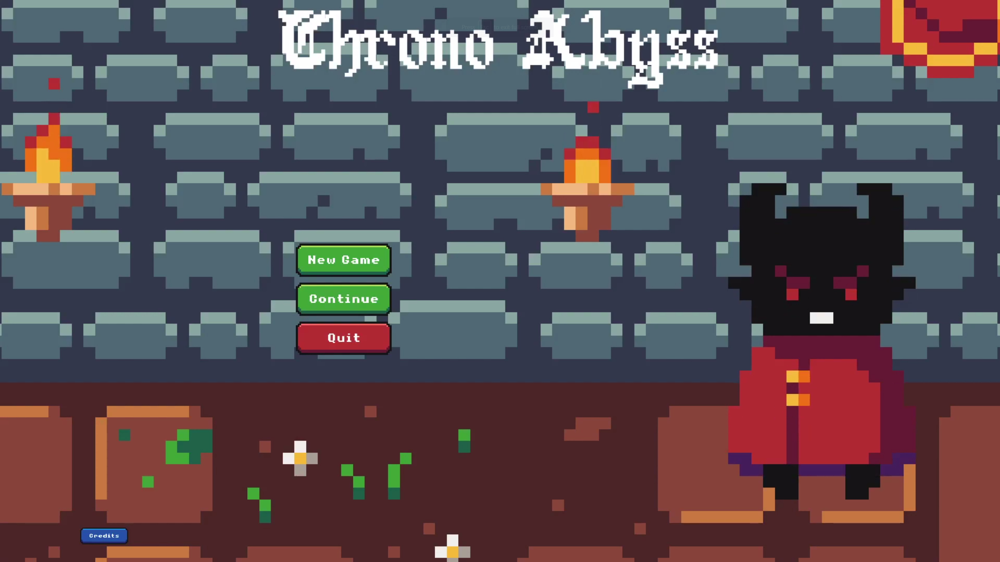
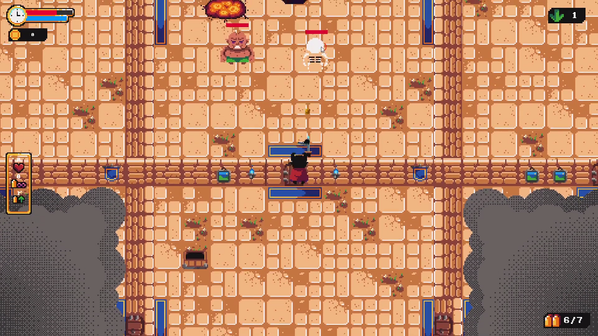
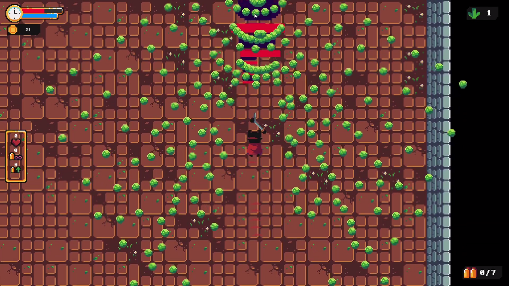
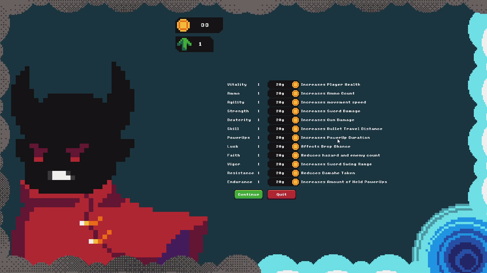
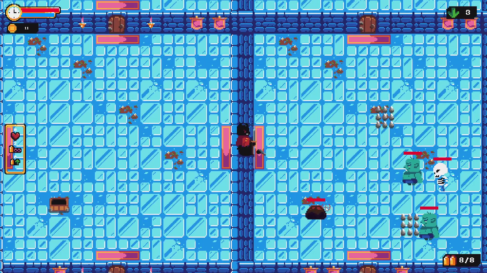
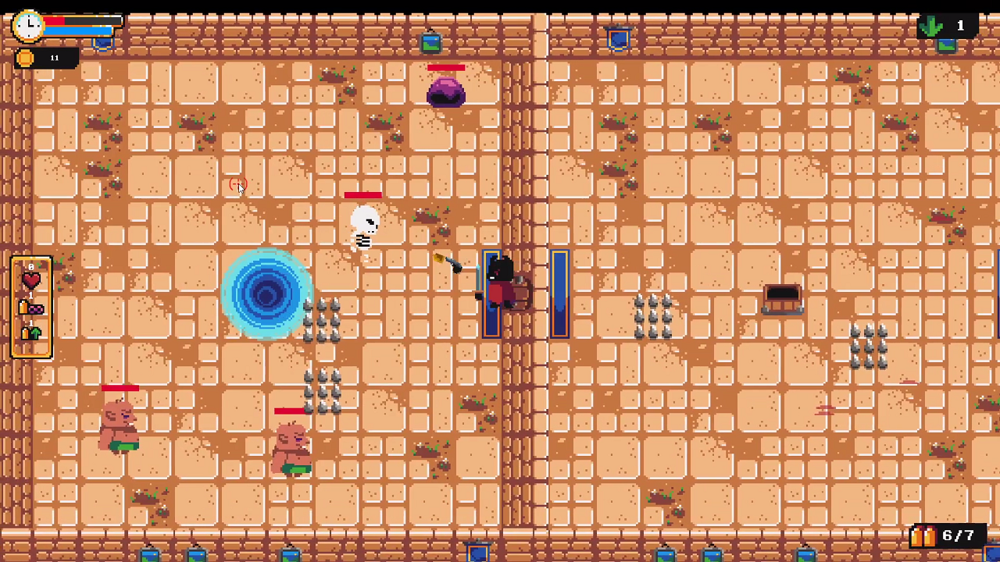

**Source:** <a href="https://github.com/christopherdufort/Dream-Eater-Interactive"><i class="large github icon"></i>christopherdufort/Dream-Eater-Interactive</a>  
**Video:** <a href="https://www.youtube.com/watch?v=_nvECaCOx4Y"><i class="large youtube icon "></i>Chrono Abyss Gameplay Demo</a>  

  
  
  
  
  
   

## Introduction
Chrono Abyss is a 2D, topdown, roguelite, bullet-hell action-RPG! It was our team's submission for the COMP 376 game project at Concordia University.  

## Game Loop
* Battle through an infinite cycle of dungeons with a boss battle at the end of each. 
* Make use of your natural time-bending abilities with the movement-time mechanic, where your environment and enemies around you only move as you move! 
* Defeating each dungeon boss unlocks the level up menu where you can improve your character. 
* Once you are strong enough, defeat the Time Creeper to open a portal to the final boss: Brogamon!

## Controls
<table>
<thead>
  <tr>
    <th>Input</th>
    <th>Action</th>
  </tr>
</thead>
<tbody>
  <tr>
    <td>W</td>
    <td>Move up</td>
  </tr>
  <tr>
    <td>A</td>
    <td>Move left</td>
  </tr>
  <tr>
    <td>S</td>
    <td>Move down</td>
  </tr>
  <tr>
    <td>D</td>
    <td>Move right</td>
  </tr>
  <tr>
    <td>Move mouse</td>
    <td>Rotate/aim gun</td>
  </tr>
  <tr>
    <td>Left-click</td>
    <td>Fire gun</td>
  </tr>
  <tr>
    <td>R</td>
    <td>Reload</td>
  </tr>
  <tr>
    <td>Space</td>
    <td>Sword slash</td>
  </tr>
  <tr>
    <td>1</td>
    <td>Invulnerable power-up</td>
  </tr>
  <tr>
    <td>2</td>
    <td>Infinite ammo power-up</td>
  </tr>
  <tr>
    <td>3</td>
    <td>Spread-shot power-up</td>
  </tr>
</tbody>
</table>