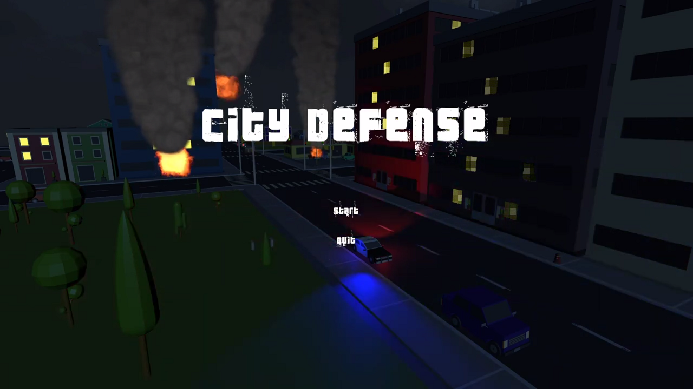
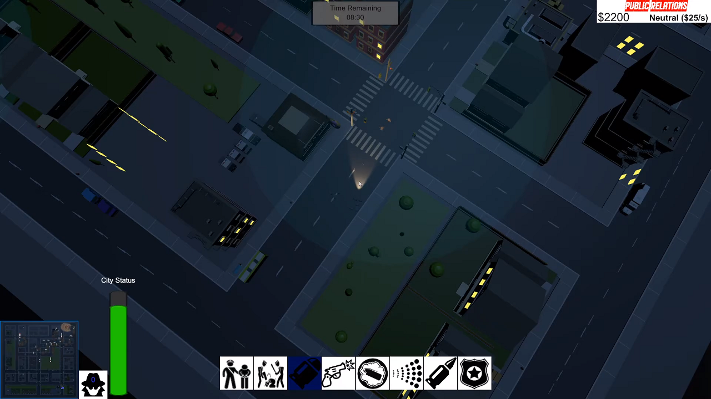
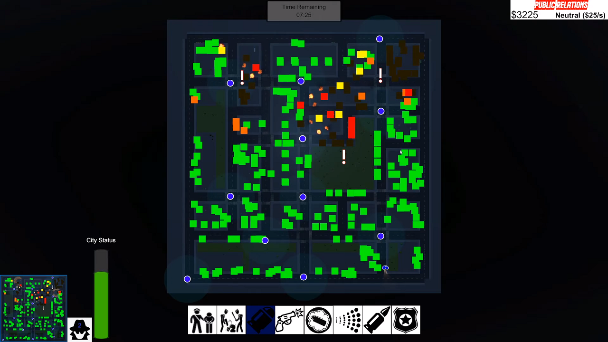
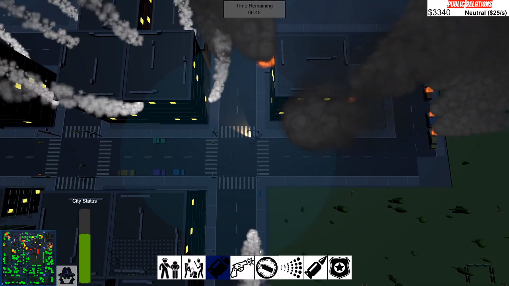
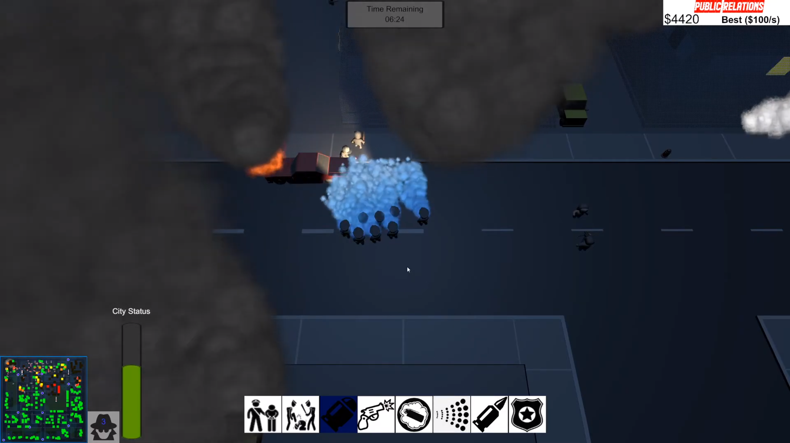
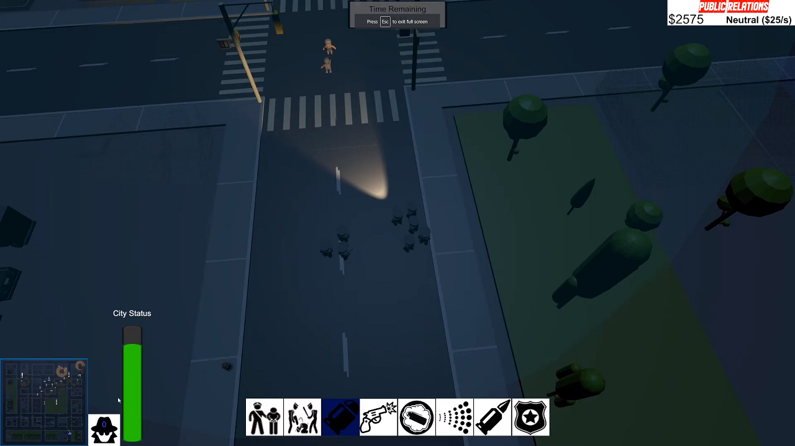

**Source:** <a href="https://github.com/zee366/CityDefense"><i class="large github icon"></i>zee366/CityDefense</a>  

**Play in Browser:** <a href="https://simmer.io/@OhmZ/city-defense">simmer.io/@OhmZ/city-defense</a>

 
  
 

  
  
  
  
  
  

## Introduction
City Defense is a realtime-strategy where you control a squad tasked with bringing peace to the city. NPCs are destroying the city and it's your job to ensure minimal property damage within 10 minutes. Buildings and cars around you are on fire while nearby reporters take record of your behaviour. If you act too aggresively, you may lose funding. What kind of squad will you be?  

This is our team's submission for the COMP 476 game project at Concordia University. It was made using Unity game engine. GitHub was used for version control and GitHub Projects for task and issue tracking and team coordination. 

## Contributions
* An RTS-style camera system with zooming and orbiting. Full zoom-out displays the strategic view (a full-screen map).
* Dynamic minimap showing damage to the city elements as well as NPC locations. Tied to the upgradeable Surveillance system. 
* The Public Relations system, which is an RTS-like resource system, providing money to the player every second. The amount is affected by the player's actions towards the NPCs. 

## Description
* Challenging AI system driven by a hierarchical task network (HTN) planner. NPCs move about and congregate in large mobs, forming plans of attack. A stamina based system regulates their attack or retreat behaviours. 
* *Public relations* resource system that regulates how much funding your squad will get based on their behaviour.
* System of night time lights bringing life to the city, including timed traffic lights.
* Well-featured UI that includes: tooltips, detailed minimap, ability buttons, city status, upgrades and resources. 
* A dense and convincing city map with hundreds of destructible objects with destruction animations and particle effects. 

## Controls

<table class="tg">
<thead>
  <tr>
    <th class="tg-fymr">Input</th>
    <th class="tg-fymr">Action</th>
	<th class="tg-fymr">Public Relations Effect</th>
  </tr>
</thead>
<tbody>
  <tr>
    <td class="tg-0pky">Left-click</td>
    <td class="tg-0pky">Click ability buttons on screen (or use hotkeys below)</td>
  </tr>
  <tr>
    <td class="tg-0pky">Right-click</td>
    <td class="tg-0pky">Move to location</td>
  </tr>
  <tr>
    <td class="tg-0pky">Scroll up / down</td>
    <td class="tg-0pky">Zoom camera in / out</td>
  </tr>
  <tr>
    <td class="tg-0pky">Scroll wheel click + drag</td>
    <td class="tg-0pky">Orbit camera</td>
  </tr>
  <tr>
    <td class="tg-0pky">1</td>
    <td class="tg-0pky">Regular arrest</td>
	<td class="tg-0pky">Good</td>
  </tr>
  <tr>
    <td class="tg-0pky">2</td>
    <td class="tg-0pky">Faster arrest</td>
	<td class="tg-0pky">Bad</td>
  </tr>
  <tr>
    <td class="tg-0pky">3</td>
    <td class="tg-0pky">Load rubber bullets</td>
	<td class="tg-0pky">Good</td>
  </tr>
  <tr>
    <td class="tg-0pky">4</td>
    <td class="tg-0pky">Fire guns</td>
  </tr>
  <tr>
    <td class="tg-0pky">5</td>
    <td class="tg-0pky">Use smoke grenade</td>
	<td class="tg-0pky">Bad</td>
  </tr>
  <tr>
    <td class="tg-0pky">6</td>
    <td class="tg-0pky">Use water cannon</td>
	<td class="tg-0pky">Good</td>
  </tr>
  <tr>
    <td class="tg-0pky">7</td>
    <td class="tg-0pky">Load stun bullets</td>
	<td class="tg-0pky">Bad</td>
  </tr>
  <tr>
    <td class="tg-0pky">8</td>
    <td class="tg-0pky">Reinforce squad with extra unit</td>
  </tr>
</tbody>
</table>

Note 1: Using the above abilities while within the blue news reporter bubbles will affect how much money you gain every second from the public relations. "Good" means your income will increase, "bad" means your income will decrease. 

Note 2: Obviously, all of the above "crowd control" abilities in real life would be seen negatively from a public relations point-of-view, but we chose to designate half of them as "good" and half as "bad" for gameplay purposes. 