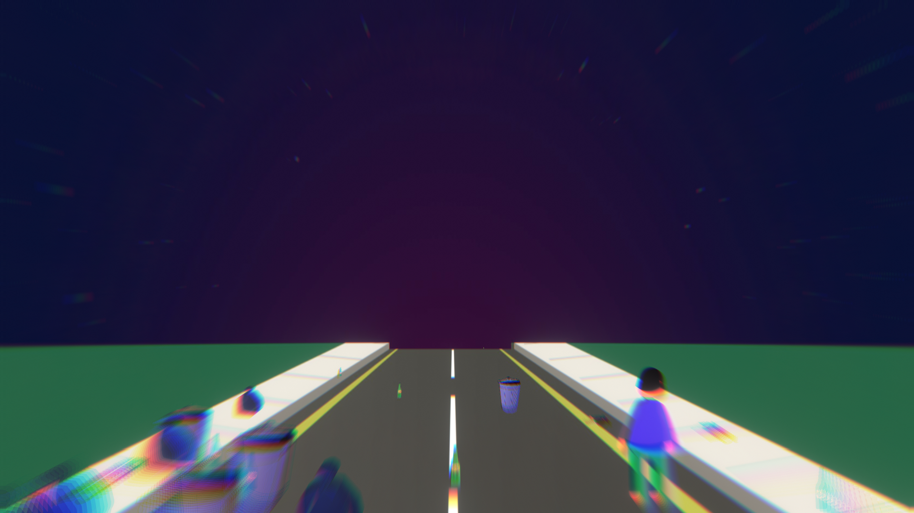
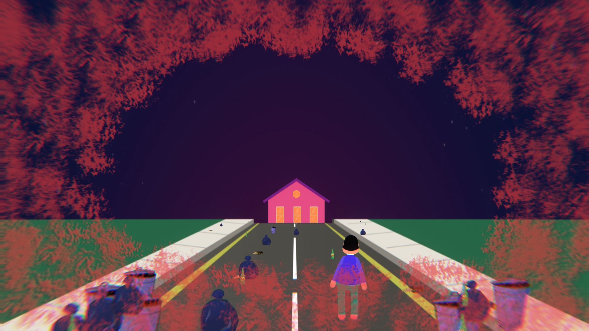
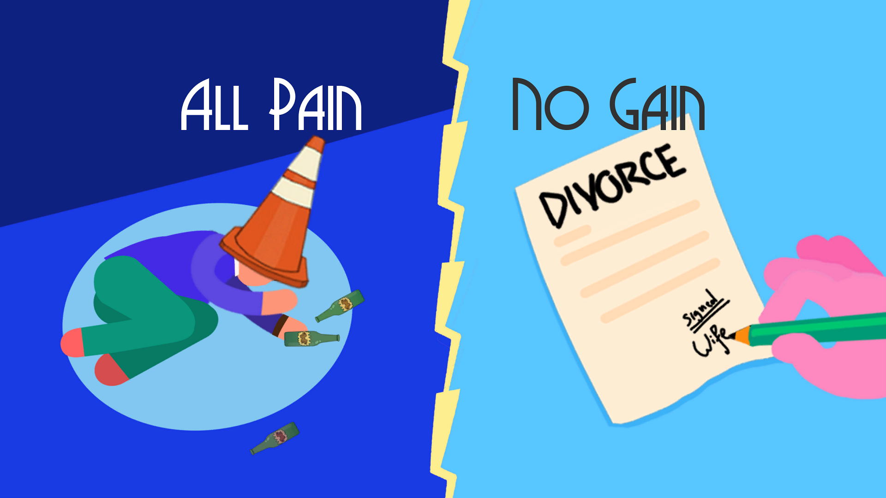

**Download and Play (Windows, Linux, Mac):** <a href="https://gotl.itch.io/honey-im-home">gotl.itch.io/honey-im-home</a>  
 
  
 

  
  
  

## Introduction
Developed by our team "GoreNest" and submitted for the 48-hour <a href="https://itch.io/jam/coco-jam/entries">CoCo Jam</a> held by Concordia Game Dev and ETS Conjure. The theme of the game jam was "No Pain, No Gain". 

## Contributions
* A "treadmill" effect to make the road and environment move under the player sprite to give the impression of moving forward in 3D space. 
* Scaling and translating the house from under a sprite mask on the horizon of the road to give the impression of approaching it from a distance. 
* An obstacle spawner that uses a fixed vector fan and relative sprite scaling to give the impression that obstacles are placed on the road in 3D. 
* A simple audio manager for music and sound effects.
* General code for tying scenes together and triggering game state events. 

## Description
* Pain is indicated by the red overlay.
* Drunkenness is indicated by the blur and wobbling effects.
* Walking into garbage increases the pain, but sobers you up.
* Walking into the green beers gets you drunker, but lowers the pain.
* It's much more difficult to move around when you're drunk.
* Either too much pain or being too drunk will make you collapse. Make sure to balance walking into garbage and drinking road beers. 

## Controls

<table class="tg">
<thead>
  <tr>
    <th class="tg-0lax">Input</th>
    <th class="tg-0lax">Action</th>
  </tr>
</thead>
<tbody>
  <tr>
    <td class="tg-0lax">W</td>
    <td class="tg-0lax">Move forward</td>
  </tr>
  <tr>
    <td class="tg-0lax">A</td>
    <td class="tg-0lax">Move left</td>
  </tr>
  <tr>
    <td class="tg-0lax">D</td>
    <td class="tg-0lax">Move right</td>
  </tr>
  <tr>
    <td class="tg-0lax">Esc</td>
    <td class="tg-0lax">Exit the game at any point</td>
  </tr>
</tbody>
</table>