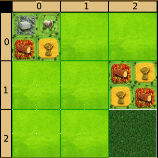
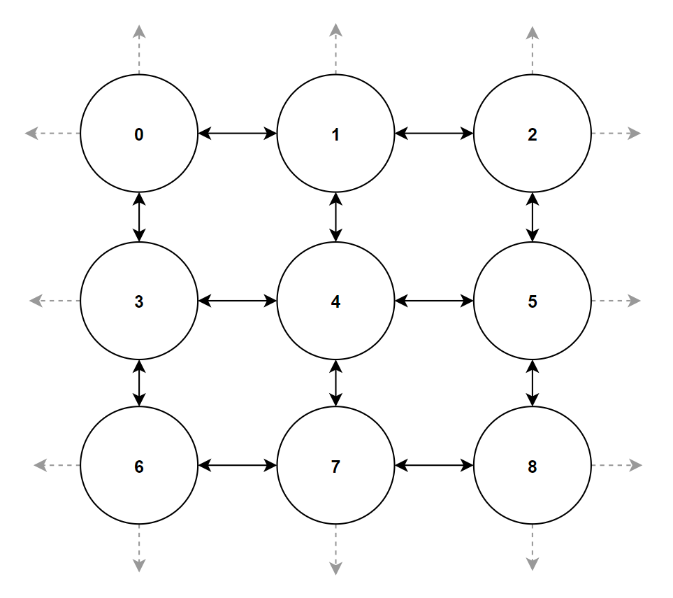
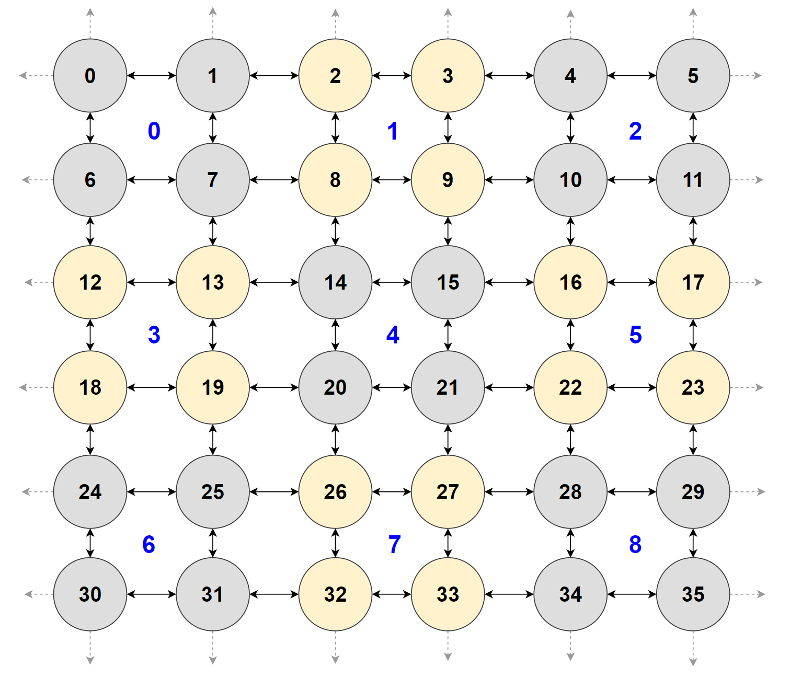
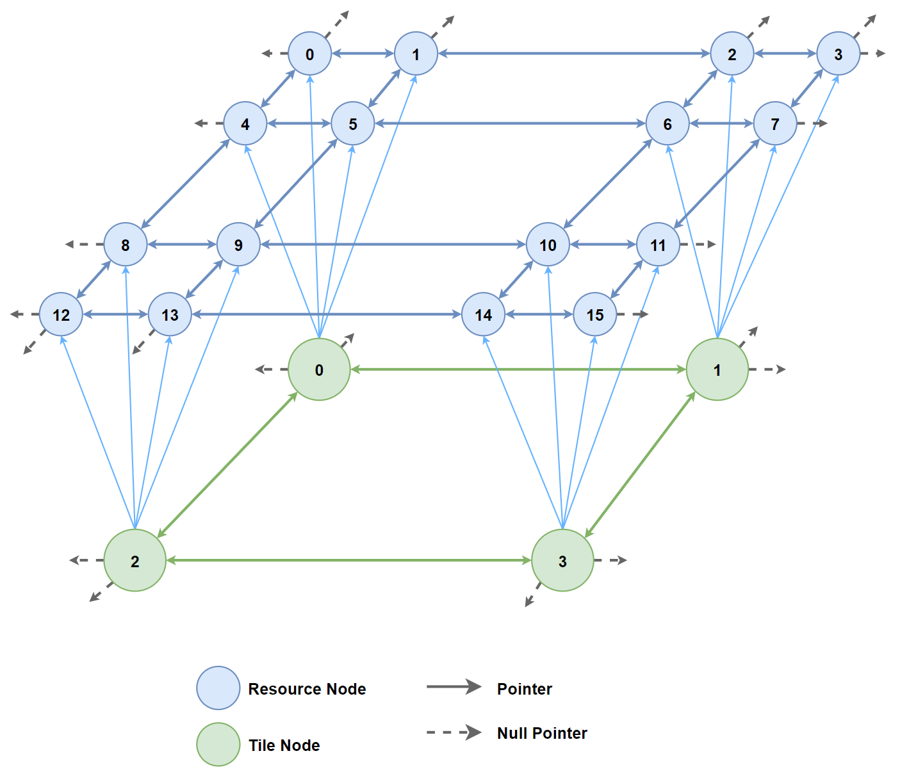

## Relevant header and source files
* GBMapLoader.cpp
* GBMap.cpp / GBMap.h
* Graph.cpp / Graph.h
* Node.cpp / Node.h
* TileNode.cpp / TileNode.h
* Resources.cpp / Resources.h

## Parsing the .gbmap file
Input file `test.gbmap`:

```
# Length and height of the grid
LENGTH	3
HEIGHT	3

# Row 0, Column 1
RESOURCE	0	STONE	SHEEP	TIMBER	WHEAT

# Row 1, Column 2
RESOURCE	5	TIMBER	WHEAT	WHEAT	TIMBER

# Row 2, Column 2
DISABLE		8
```

The above gbmap file will result in the gameboard shown below. Note that the order of the resources from left-to-right in the gbmap file corresponds in a clockwise order starting from the upper-left resource node.

 

The parsing is done with a while-loop that iterates through the file line-by-line. The loop is continued if an empty or whitespaced line is detected. If no such line is detected, then it is tokenized and the first string token is compared in an if-else block where matching certain keywords will determine in which containers the data is stored.  Lines that do not start with any of the keywords are simply ignored and this property can be used to include comments as is done in the test file with the '#' symbol.  

```cpp
while (inFile) {
	getline(inFile, lineRead);

	bool whiteSpaced = true;
	for (int i = 0; i < lineRead.length(); i++)
		if (!isspace(lineRead.at(i))) {
			whiteSpaced = false;
			break;
		}

	if (lineRead.empty() || whiteSpaced)
		continue;

	stringstream strstr(lineRead);
	istream_iterator<string> it(strstr);
	istream_iterator<string> end; 
	vector<string> results(it, end);

	if (results[0].compare("LENGTH") == 0) 
		length = std::stoi(results[1]);
	else if (results[0].compare("HEIGHT") == 0) 
		height = std::stoi(results[1]);	
	else if (results[0].compare("RESOURCE") == 0){
		resourceData[std::stoi(results[1])] = { strToEnum(results[2]), strToEnum(results[3]), strToEnum(results[4]), strToEnum(results[5]) };
		resourceIndices.push_back(std::stoi(results[1]));
	}
	else if (results[0].compare("DISABLE") == 0) {
		disableData.push_back(std::stoi(results[1]));
	}
}
inFile.close();
```

## Creating and linking the two graphs

In `GBMapLoader.cpp`, the length and height values are read from the map file are passed to the function `Graph::makeGridGraph`. Note that there are 4 resource nodes to ever tile node, so the length and height are both multiplied by 2 for the resource graph.  

```cpp
gb_map.getTileGraph()->makeGridGraph(length, height, NodeType::TILE);
gb_map.getResourceGraph()->makeGridGraph(length * 2, height * 2, NodeType::RESOURCE);
```

In `Graph.cpp`, function `Graph::makeGridGraph` creates the nodes which are unconnected at first, but the for-loop and if-statements below ensure that edges pointing to other nodes are added in order to create a connected grid. Each of the four if-statements is responsible for its own direction: up, down, left, right, respectively. The logic creates connections on the "inside" of the grid, while leaving all pointers on the edges null.  

```cpp
for (int i = 0; i < totalNodes; i++)
{
	if (i - length >= 0)
		nodes[0][i]->addEdge(nodes[0][i - length], Direction::UP);
	if (i + length <= totalNodes - 1)
		nodes[0][i]->addEdge(nodes[0][i + length], Direction::DOWN);
	if (i - 1 >= 0 && i % length != 0)
		nodes[0][i]->addEdge(nodes[0][i - 1], Direction::LEFT);
	if (i + 1 <= totalNodes - 1 && (i+1)%length != 0)			
		nodes[0][i]->addEdge(nodes[0][i + 1], Direction::RIGHT);
}
```

The above processes result in two isolated graphs, one for tiles and one for resources, as visualized below. 

  

 

The challenge now is to link the corresponding tile nodes to their respective cluster of 4 resource nodes. We can do this mathematically using the tile node ID as follows:  

 
   
```cpp
for (int i = 0; i < totalNodes; i++)
{
	if (rowCount == *this->length) {
		rowCount = 0; 
		rowValue++;
	}
 
	int firstResource = (i * 2) + (*this->length*rowValue*2);

	static_cast<TileNode*>(nodes[0][i])
		->linkResourceNode(static_cast<Resource*>(resourceGraph->getNode(firstResource)), 0);
	static_cast<TileNode*>(nodes[0][i])
		->linkResourceNode(static_cast<Resource*>(resourceGraph->getNode(firstResource + 1)), 1);
	static_cast<TileNode*>(nodes[0][i])
		->linkResourceNode(static_cast<Resource*>(resourceGraph->getNode(firstResource + *this->length * 2)), 2);
	static_cast<TileNode*>(nodes[0][i])
		->linkResourceNode(static_cast<Resource*>(resourceGraph->getNode(firstResource + *this->length * 2 + 1)), 3);

	rowCount++; 
}
```

The two graphs combined result in a three-dimensional grid graph that resembles a trapazoidal prism, as shown below. For simplicity, a 2x2 tile grid graph is shown instead of the 3x3 example from `test.gbmap`.  


