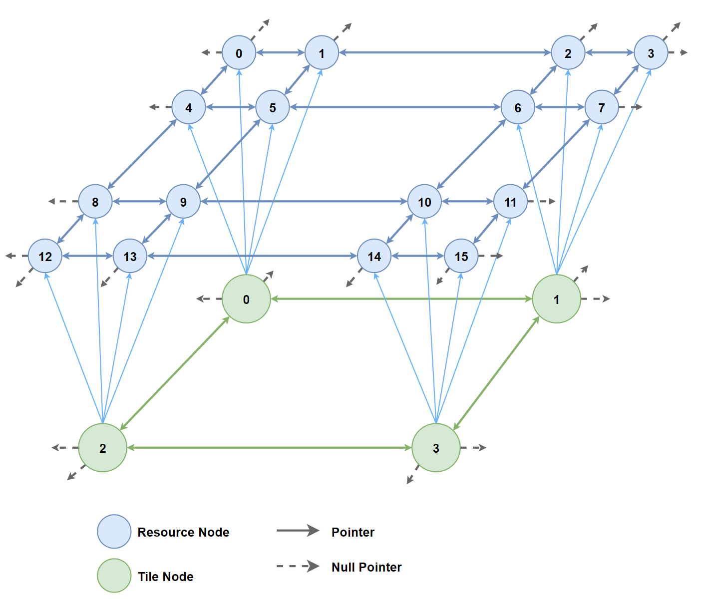

Input file (test.gbmap):

```
# Length and height of the grid
LENGTH	3
HEIGHT	3

#Row 0, Column 1
RESOURCE	0	STONE	SHEEP	TIMBER	WHEAT

#Row 1, Column 2
RESOURCE	5	TIMBER	WHEAT	WHEAT	TIMBER

#Row 2, Column 2
DISABLE		8
```

 

In GBMapLoader.cpp, the length and height values read from the map file are passed to the function Graph::makeGridGraph. Note that there are 4 resource nodes to ever tile node, so the length and height are both multiplied by 2 for the resource graph.  

```cpp
gb_map.getTileGraph()->makeGridGraph(length, height, NodeType::TILE);
gb_map.getResourceGraph()->makeGridGraph(length * 2, height * 2, NodeType::RESOURCE);
```

In Graph.cpp, function Graph::makeGridGraph creates the nodes which are unconnected at first, but the for-loop and if-statements below ensure that edges pointing to other nodes are added in order to create a connected grid. Each of the four if-statements is responsible for its own direction: up, down, left, right, respectively. The logic creates connections on the "inside" of the grid, while leaving all pointers on the edges null.  

```cpp
for (int i = 0; i < totalNodes; i++)
{
	if (i - length >= 0)
		nodes[0][i]->addEdge(nodes[0][i - length], Direction::UP);
	if (i + length <= totalNodes - 1)
		nodes[0][i]->addEdge(nodes[0][i + length], Direction::DOWN);
	if (i - 1 >= 0 && i % length != 0)
		nodes[0][i]->addEdge(nodes[0][i - 1], Direction::LEFT);
	if (i + 1 <= totalNodes - 1 && (i+1)%length != 0)			
		nodes[0][i]->addEdge(nodes[0][i + 1], Direction::RIGHT);
}
```

After both tile and resource graphs are created, they are linked using an algorithm. The two graphs combined result in a three-dimensional grid graph that resembles a trapazoidal prism, as shown below. For simplicity, a 2x2 tile grid graph is shown instead of the 3x3 example from the gbmap file.  


