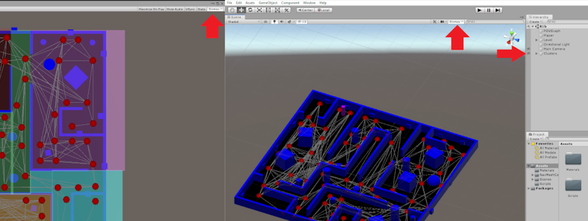
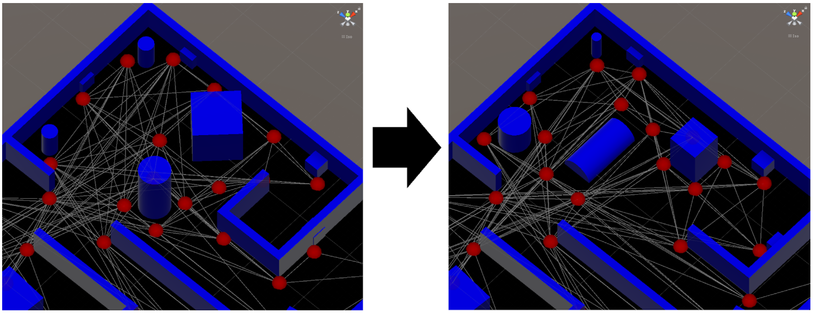
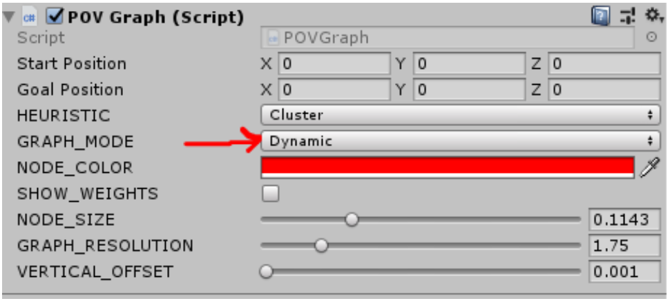
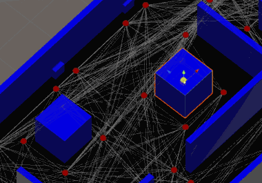
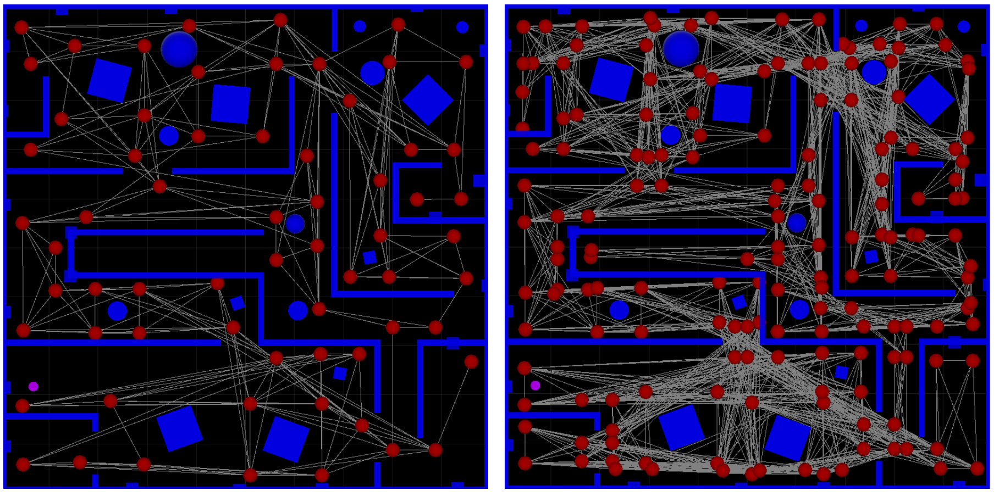
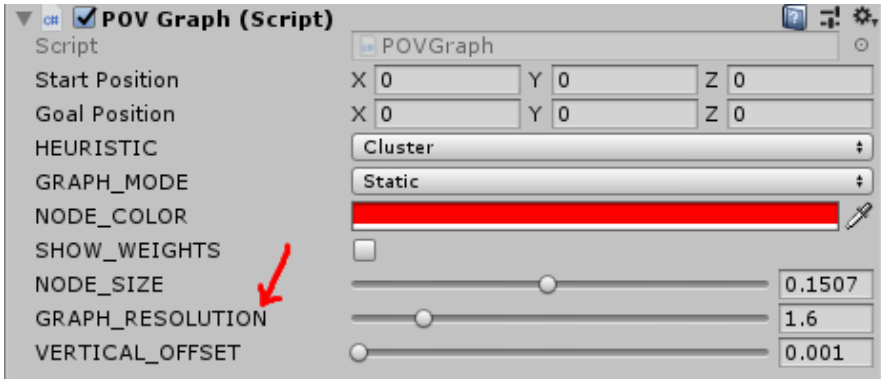
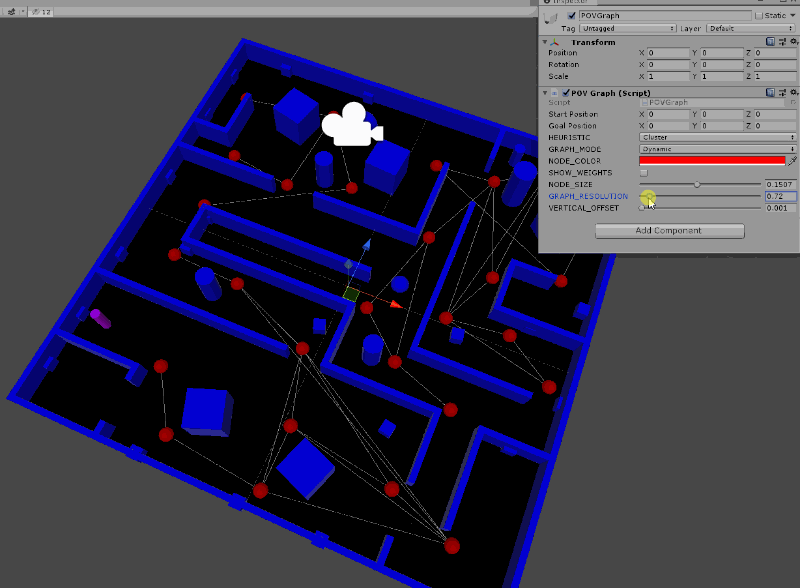
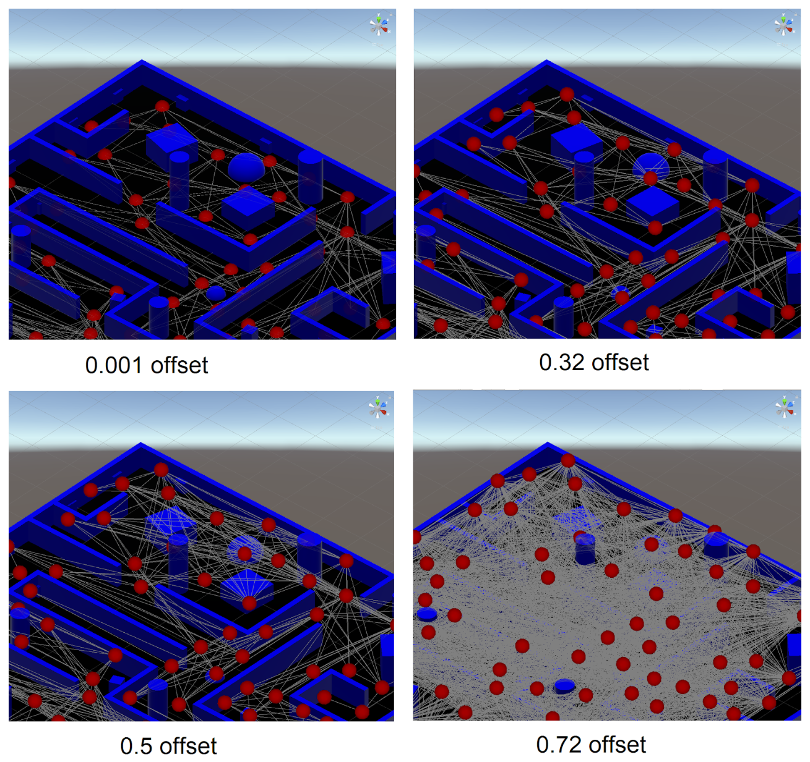
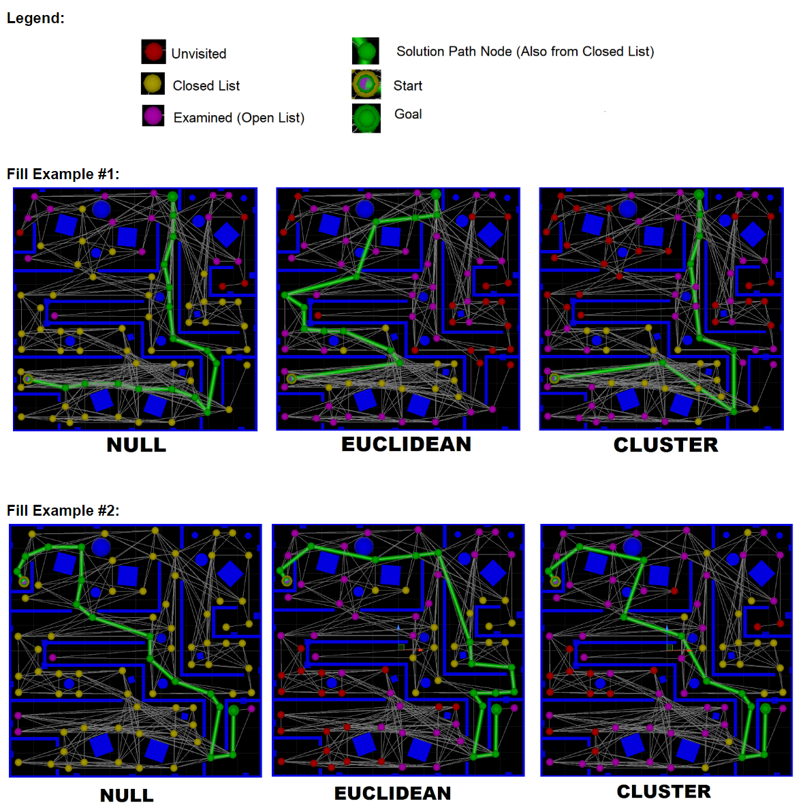
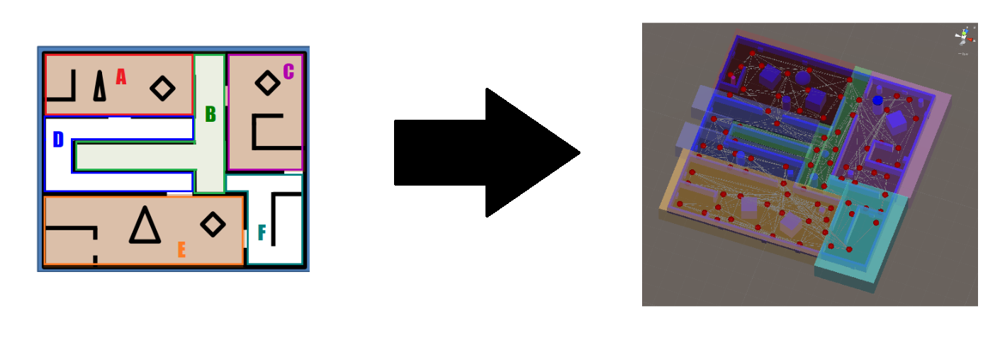

**Source:** <a href="https://github.com/OmarAlFarajat/Unity-POV-Graph"><i class="large github icon"></i>OmarAlFarajat/Unity-POV-Graph</a>
## Introduction
This Unity project demonstrates a tool that dynamically generates a points-of-visibility (POV) graph that can adapt to geometrical changes in the level and character geometry in real-time while in the Unity editor. It is also capable of finding the shortest path from the player position to the goal position that is clicked by the user using an A* search with variable heuristics: Null, Euclidian, and Cluster.

## Notes and Instructions
* Gizmos should be turned on for both the Game preview and Scene windows. It’s best to have the Game preview detached as a separate window to see them side-by-side, with the Clusters hidden in the scene as follows: 

* The XML file “LUTable.xml” included with the project holds the data for the Cluster heuristic lookup table. This lookup table was configured specifically with the POVGraph resolution of 1.6 and a player radius of 0.96 and distinct layout of objects. Any changes to those values, as well as any changes to the level geometry, will require that the XML file be re-written by uncommenting the appropriate code in POVGraph.cs (see comments).  

## Features
### Real-Time Automatic Node Placement Based on Level and Player Geometry 
  

Changing the position, orientation or scale of obstacles and walls in the editor will remove or add nodes and edges automatically. Not a single node in the picture above is placed manually—it is all done automatically in the editor! There are also optimizations to ensure that there are no duplicate (or near-duplicate) nodes generated from two different object bounds, as well as omitting any nodes that find themselves within the bounds of an obstacle or wall. 
 
  

In order to see the changes occuring live in the editor, GRAPH_MODE must be set to “Dynamic”, however, this is very resource intensive and is not recommended when previewing the game in the editor with the Play button. If you are previewing the game with the Play button, it is recommended to set GRAPH_MODE to “Static” instead for better performance, as it will only update the graph at the start of the game and when a goal node is placed by clicking on the map.  

  

### Graph Resolution/Detail
  

Resolution values of 1.31 (left) and 9.4 (right), with a Player radius of 1.25. Higher resolution graphs tend to generate more nodes and edges, and as such, are much more resource intensive. This allows the level designer to adjust the graph to their needs and performance requirements. 

  

  

### Vertical Offset
  
The graph can be vertically offset from the ground. This can be potentially used to allow certain NPCs (such as enemies that fly) to go over obstacles that are low enough. Note that with a higher offset, more edges are created since the nodes are all more visible to each other. With a higher offset, it may be a good idea to decrease the resolution. 

### A* Search With Null, Euclidean and Cluster Heuristics
The Null heuristic is implemented with early termination (stops as soon as it finds the goal node). As can be seen below, Null is worse than Euclidean and Cluster because there are almost no red nodes (unvisited) left at the end of the search. Euclidean and Cluster require less nodes to be visited, so they are both more efficient compared to Null. Euclidean and Cluster seem to process a similar number of nodes, but Cluster seems to sometimes create a more “direct” path to the goal, but this depends on where the start and goal nodes are placed.  
  

### Clusters Implemented as Transparent Bounding Boxes
Each node is checked to see which cluster it is in and is given the appropriate membership type. Membership attribution is only relevant when the lookup table XML file is being created (by uncommenting the code in POVGraph.cs — see comments in code for more details). 
  